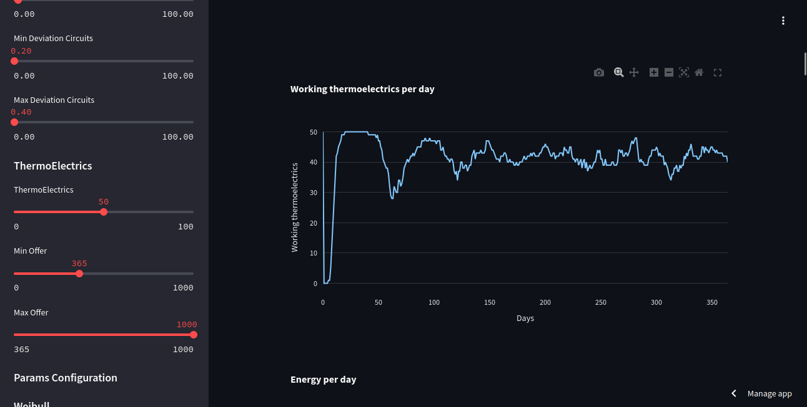

# First Simulation Project. Thermoelectric Plants Events System

## Problem

There is a set of thermoelectric plants and circuits that they must power. It is known that the time between breakdowns follows a Weibull distribution, and the time it takes for a repair follows a Log-normal distribution. The goal is to analyze which set of repairs to perform in order to affect the fewest number of circuits possible. Additionally, it is known that the electrical consumption of a circuit follows a certain distribution, and in the event of a deficit, it is necessary to affect the availability of electricity to some extent.

Different system planning strategies will be compared. The planner can make decisions such as:

- Providing maintenance to a thermoelectric plant
- Shutting down a circuit to some extent

Hypotheses will be formulated, and experiments will be designed to validate or invalidate them

#### [App Link](https://simulatethermoelectrics.streamlit.app/)

